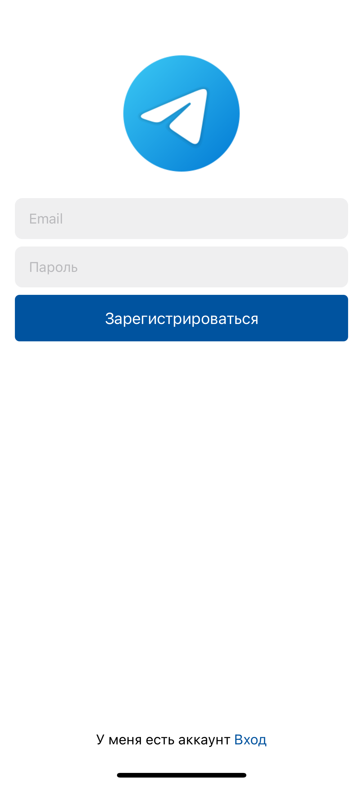
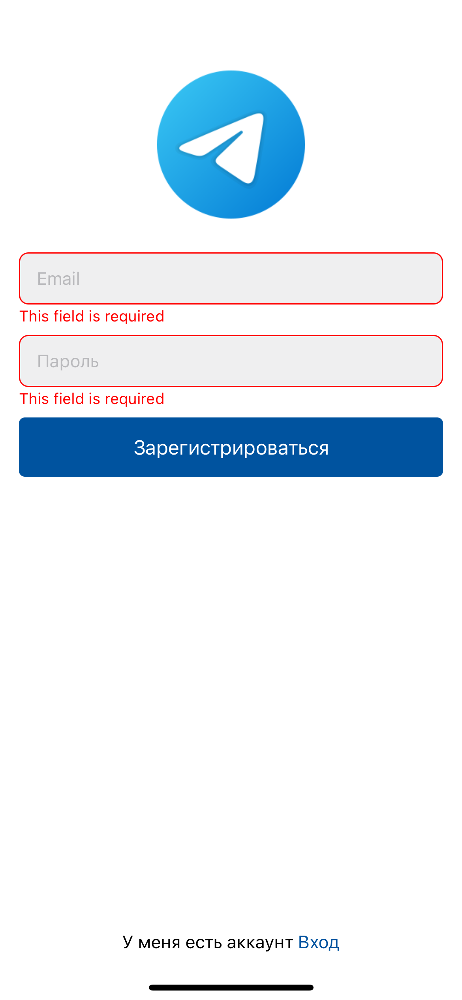
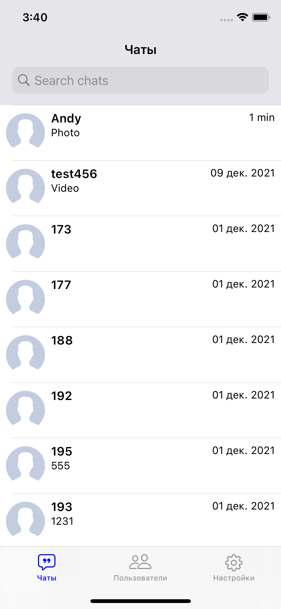
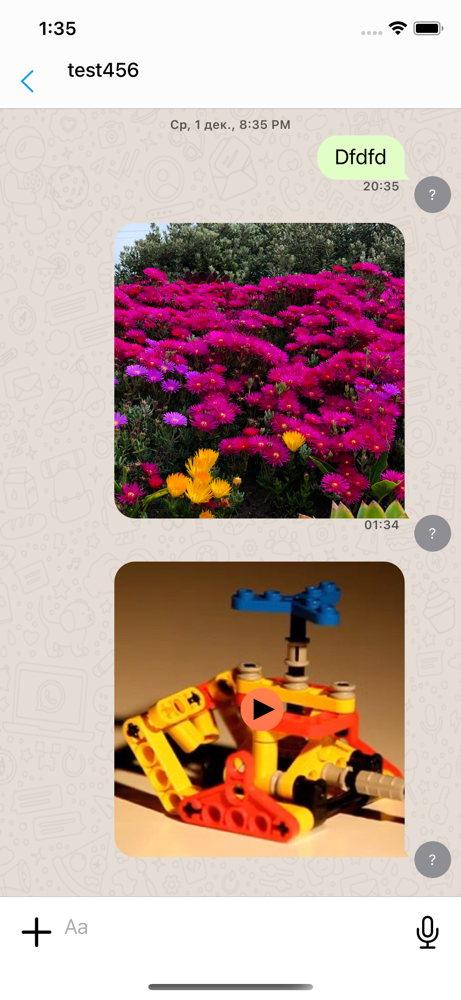
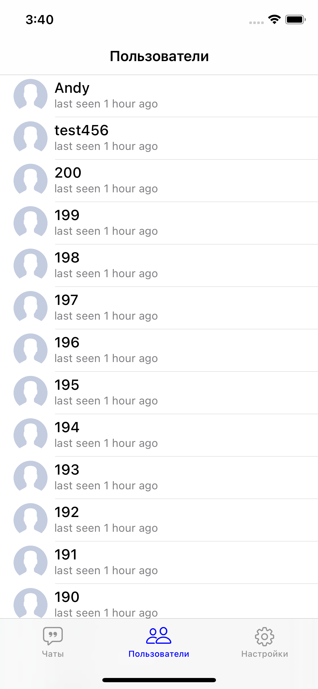
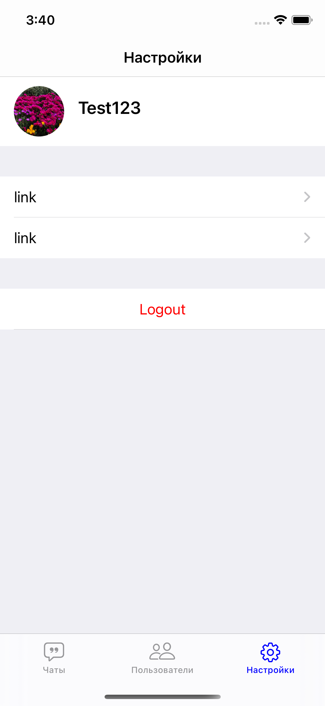

#  MessangerApp

Чат
Архитектура MVVM-C.

Features:
- [x] Регистрация/авторизация через email
- [x] Валидация полей с помощью правил
- [x] Просмотр списка юззеров
- [x] Отравка тестовых сообщений
- [x] Отправка картинок/видео
- [ ] Отправка аудиосообщений
- [ ] Группы
- [ ] Push уведомления

Used Frameworks:
- Firebase
- Gallery
- MessageKit
- Then
- SKPhotoBrowser
- SnapKit
- SwiftLint
- SwiftyBeaver
- Swinject

## Screens

|||||
|:----------------------------:|:------------------------:|:------------------------:|:------------------------:|

|||||
|:----------------------------:|:----------------------------:|:------------------------:|:------------------------:|
